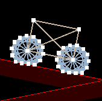
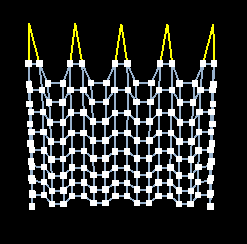
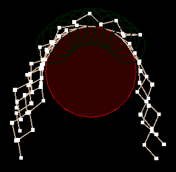
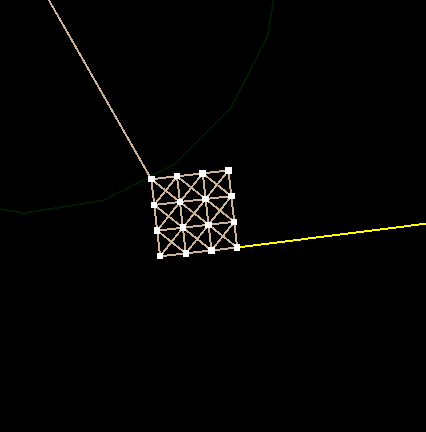

# Particle Simulation - Simulation in Computer Graphics Project 1

This project implements a particle system for the TU/e course Simulation in Computer Graphics, supporting multiple forces, constraints, integration schemes, collision objects, and interactive features. The goal of the project is to achieve visually convincing results while maintaining real-time performance.

## Project Report

For a detailed description of the implementation, experiments, and results, see the full report:

[Simulation in Computer Graphics - Project 1 Report](Simulation_in_Computer_Graphics___Project_1.pdf)

## Example Simulations

Below are some example screenshots from various simulation scenes:

### Car Simulation

### Cloth Simulation

### Hair Simulation

### Rigid Body Simulation

## Requirements

To build and run this project, you need the following:

- **C++17** compatible compiler (e.g., g++, clang++)
- **OpenGL** development libraries
- **GLUT**
- **libpng**

## Compiling and running the application

Instructions are given here depending on operating system:

- [Linux](./compile_linux.txt)
- [Mac OS](./compile_mac.txt)
- [Windows](./compile_win10.txt)

## How to use the application

- Toggle simulation: `spacebar`
- Dump frames: `d`
- Quit application: `q`
- Toggle force visualization: `f`
- Switch to a given scene: `1`-`9`
- Switch integration scheme:
  - Euler: `e`
  - Midpoint: `m`
  - Runge Kutta: `r`
  - Implicit Euler: `i` (This does only work in scenes, that don't use any forces except Spring, Linear or QuadraticDrag)
- Apply spring force to particle: click and hold `left mouse button`
- Apply wind force: click and hold `right mouse button`
